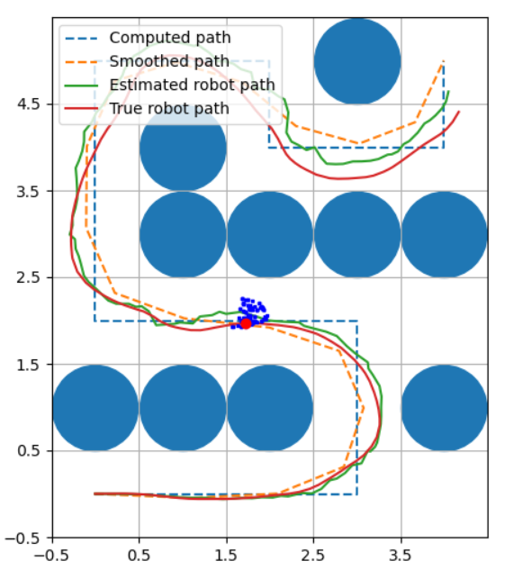

## CS373: Artificial Intelligence for Robotics | Programming a Robotic Car
### A Udacity Course instructed by Sebastian Thrun

### Course Description
Learn how to program all the major systems of a robotic car from the leader of Google and Stanford's autonomous driving teams. This class provides the gist of many essential robotic stacks, including: probabilistic inference, planning and search, localization, tracking and control. Along with insightful lectures, there are many interesting problems and a challenging final project.

This course is offered as part of the Georgia Tech Masters in Computer Science. The updated course includes a final project, where you must chase a runaway robot that is trying to escape!

### THIS IS MY REPOSITORY FOR THE COURSE
Below are some pictures from my programs:

*I have consulted several sources, especially on the Udacity discussion forum. So, feel free to use it as a reference. Hope to receive your feedback.*
